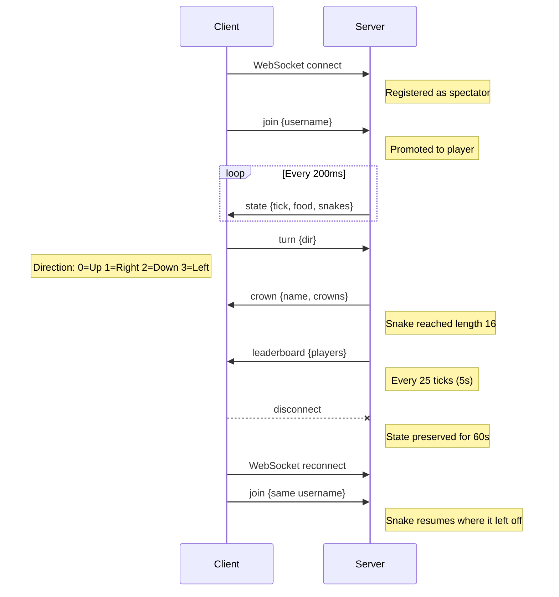

# Oxidar Multiplayer Snake

A multiplayer snake game server for the [oxidar.org](https://oxidar.org) coding session. The server runs the game; your job is to build a Rust client that connects to it. Terminal, desktop, web, embedded -- pick your platform.

The server handles all game logic: movement, food, collisions, crowns, and leaderboard. Your client just needs to open a WebSocket, send a couple of messages, and render the state it receives.

---

## Running the Server

```bash
cargo run
```

The server reads its configuration from `config.toml` in the working directory. The defaults are fine for the session -- you should not need to change anything.

To verify it is running, you should see log output indicating it is listening on port 9001.

---

## Connection Details

| Property   | Value                          |
|------------|--------------------------------|
| Protocol   | WebSocket                      |
| URL        | `ws://localhost:9001`          |
| Frames     | Binary (not text)              |
| Encoding   | MessagePack                    |

All messages in both directions are binary WebSocket frames containing MessagePack-encoded maps. Messages use named fields (not positional arrays), so they are self-describing and easy to inspect.

---

## Protocol Reference

Every message has a `"type"` field that identifies it.

### Client to Server

There are only two messages your client needs to send.

**join** -- Register as a player:

```
{
  "type": "join",
  "username": "<string>"
}
```

- `username`: Your display name. Must be non-empty. If the username is already connected, you will receive an error.

**turn** -- Change your snake's direction:

```
{
  "type": "turn",
  "dir": <u8>
}
```

- `dir`: Direction encoded as an integer:

| Value | Direction |
|-------|-----------|
| 0     | Up        |
| 1     | Right     |
| 2     | Down      |
| 3     | Left      |

Reversals (e.g., turning from Up to Down) are silently ignored. Invalid values outside 0-3 are also ignored.

### Server to Client

**state** -- Broadcast every tick (5 times per second by default):

```
{
  "type": "state",
  "tick": <u64>,
  "food": [<u16>, <u16>],
  "snakes": [
    {
      "name": "<string>",
      "body": [[<u16>, <u16>], ...],
      "dir": <u8>,
      "crowns": <u32>,
      "color": "<string>",
      "country": "<string>" | null
    }
  ]
}
```

- `tick`: Monotonically increasing tick counter.
- `food`: `[x, y]` position of the current food item on the board.
- `snakes`: Array of all active (connected) snakes.
  - `name`: The player's username.
  - `body`: Array of `[x, y]` positions. The first element is the head.
  - `dir`: Current direction (same encoding as the turn message).
  - `crowns`: Total crowns earned by this player.
  - `color`: Hex color string assigned to this snake on join (e.g. `"#FF5733"`). Stable for the lifetime of the player's session, including across reconnects. Use this to consistently color each snake in your renderer.
  - `country`: ISO 3166-1 alpha-2 country code resolved from the player's IP on connect (e.g. `"AR"`, `"US"`), or `null` if the lookup failed or the player connected from a private/local IP.

**crown** -- Broadcast when a player earns a crown:

```
{
  "type": "crown",
  "name": "<string>",
  "crowns": <u32>
}
```

- `name`: The player who earned the crown.
- `crowns`: Their new total crown count.

**leaderboard** -- Broadcast every 25 ticks (every 5 seconds):

```
{
  "type": "leaderboard",
  "players": [
    {
      "name": "<string>",
      "crowns": <u32>,
      "length": <u16>,
      "alive": <bool>,
      "country": "<string>" | null
    }
  ]
}
```

- `players`: Sorted by crowns descending, then by length descending.
  - `alive`: `true` if the player is currently connected, `false` if disconnected (within the reconnection window).
  - `length`: Current snake length, or 0 if disconnected.
  - `country`: ISO 3166-1 alpha-2 country code, or `null`. Same value as in the `state` message.

**error** -- Sent to a single client when something goes wrong:

```
{
  "type": "error",
  "msg": "<string>"
}
```

Common error messages include: username already connected, empty username, server at capacity, spectators cannot send turns, and already joined.

---

## Game Rules

- **Board**: 64 wide, 32 tall. Coordinates range from `(0, 0)` at the top-left to `(63, 31)` at the bottom-right.
- **Toroidal wrapping**: The board wraps on all edges. Moving off the right side puts you on the left; moving off the bottom puts you on the top.
- **Food**: Exactly one food item on the board at all times. When eaten, a new one spawns at a random position on the next tick.
- **Starting length**: 4 segments.
- **Growth**: Eating food adds one segment to your snake.
- **Crown**: When your snake reaches length 16, you earn a crown and your snake resets to length 4. You keep playing.
- **No collision, no death**: Snakes overlap freely. You never die. The game is purely about collecting crowns.
- **Movement**: Snakes are always moving. You can only change direction (you cannot stop). Reversals are ignored.
- **Max players**: 32 concurrent players.
- **Tick rate**: 200ms (5 ticks per second).

---

## Connection Lifecycle

### Join Flow

1. Open a WebSocket connection to `ws://localhost:9001`.
2. Send a `join` message with your username (binary frame, MessagePack encoded).
3. You will immediately start receiving `state` messages every tick.
4. Send `turn` messages whenever you want to change direction.

### Spectator Mode

If you connect but never send a `join` message, you are a spectator. You receive all `state`, `crown`, and `leaderboard` broadcasts, but you cannot send `turn` messages. Spectators do not count toward the player limit.

This is useful for building a viewer or dashboard without taking up a player slot.

### Reconnection

If your client disconnects, the server preserves your snake's state (position, direction, length, crowns) for 60 seconds. If you reconnect with the same username within that window, you resume exactly where you left off -- your snake starts moving again on the next tick.

If the timeout expires before you reconnect, your state is purged and you start fresh.

### Disconnect Behavior

When a player disconnects, their snake is immediately removed from the board. Other players will stop seeing it in `state` messages. The disconnected player still appears in `leaderboard` messages with `alive: false` and `length: 0` until their state is purged.

---

## Quick-Start Example Flow

Here is the typical sequence for a minimal client:

1. **Connect** -- Open a WebSocket to `ws://localhost:9001`.
2. **Send join** -- Encode `{"type": "join", "username": "yourname"}` as MessagePack and send it as a binary frame.
3. **Receive state** -- The server starts sending `state` messages every 200ms. Parse them to get the board state.
4. **Render** -- Draw the food and all snakes. Your snake is the one whose `name` matches your username.
5. **Send turn** -- When the player presses a key, encode `{"type": "turn", "dir": N}` as MessagePack and send it.
6. **Loop** -- Keep receiving state and sending turns. Handle `crown` and `leaderboard` messages as you see fit.

That is it. There is no handshake, no authentication, no heartbeat. Just join and play.



---

## Client Ideas

Every client needs WebSocket + MessagePack. The common foundation is the same regardless of platform:

```bash
cargo add tokio tokio-tungstenite futures-util rmp-serde serde serde_json
```

```rust
use tokio_tungstenite::connect_async;
use futures_util::{SinkExt, StreamExt};
use tokio_tungstenite::tungstenite::Message;

let (mut ws, _) = connect_async("ws://localhost:9001").await?;

// Join
let join = rmp_serde::to_vec_named(&serde_json::json!({
    "type": "join",
    "username": "rustsnake"
}))?;
ws.send(Message::Binary(join.into())).await?;

// Receive
while let Some(Ok(msg)) = ws.next().await {
    if let Message::Binary(data) = msg {
        let value: serde_json::Value = rmp_serde::from_slice(&data)?;
        // handle value["type"]
    }
}
```

Pick a platform and add the rendering layer on top:

### Terminal -- ratatui

Lowest friction option. No GPU, no windowing -- just your terminal. Ideal if you want to focus on the protocol and game logic.

```bash
cargo add ratatui crossterm
```

[`ratatui`](https://ratatui.rs) gives you a grid-based canvas that maps naturally to the 64x32 board. Use `crossterm` for raw-mode input and key events. Run the WebSocket receiver and TUI render loop on separate tokio tasks.

### 2D Graphics -- macroquad

Standalone window with immediate-mode 2D drawing. Minimal boilerplate -- one crate, no ECS, no engine.

```bash
cargo add macroquad
```

[`macroquad`](https://macroquad.rs) provides `draw_rectangle`, input handling, and a game loop out of the box. Good choice if you want colored squares on screen fast. Note: macroquad runs its own async runtime, so you'll use its networking or spawn a thread for the WebSocket connection.

### Desktop GUI -- slint

Declarative UI with `.slint` markup files and Rust business logic. Cross-platform (macOS, Linux, Windows) and also runs on embedded Linux (Raspberry Pi with a display).

```bash
cargo add slint
```

[`slint`](https://slint.dev) separates layout/styling from logic. Define the board as a grid component in `.slint`, bind snake data from Rust. Good fit if you want a polished UI or plan to run it on a kiosk/embedded device.

### Web (WASM) -- leptos / dioxus

Compile to WebAssembly, run in the browser. Use the browser's native `WebSocket` API.

```bash
# leptos
cargo add leptos
# or dioxus
cargo add dioxus
```

[`leptos`](https://leptos.dev) is a reactive web framework with fine-grained reactivity. [`dioxus`](https://dioxuslabs.com) offers a React-like model and can also target desktop and mobile from the same codebase. Both work well -- pick whichever style you prefer.

### Game Engine -- bevy

Full ECS game engine with 2D sprite rendering, asset loading, and input handling.

```bash
cargo add bevy
```

[`bevy`](https://bevyengine.org) is more setup than the other options, but gives you the most power. Model snakes as entities, food as a component, and let Bevy's systems handle rendering and input. Great if you want to learn ECS or add particle effects when a crown is earned.

---

## MCP Server — AI-Assisted Client Development

An [MCP server](https://modelcontextprotocol.io) is available to help AI assistants (Claude, Cursor, etc.) build snake clients for you. It provides the protocol spec, game rules, encoding/decoding utilities, and ready-to-run client examples.

**Endpoint**: `https://snakes-mcp.oxidar.org/mcp`

Add to Claude Desktop (`~/Library/Application Support/Claude/claude_desktop_config.json`):

```json
{
  "mcpServers": {
    "oxidar-snake": {
      "type": "http",
      "url": "https://snakes-mcp.oxidar.org/mcp"
    }
  }
}
```

See [`mcp/README.md`](mcp/README.md) for setup with other clients and the full list of tools.

---

## Configuration Reference

All values can be changed in `config.toml`:

```toml
[game]
board_width = 64
board_height = 32
max_players = 32
tick_ms = 200
snake_start_length = 4
snake_win_length = 16
disconnect_timeout_s = 60
leaderboard_interval_ticks = 25

[server]
host = "0.0.0.0"
port = 9001
```
